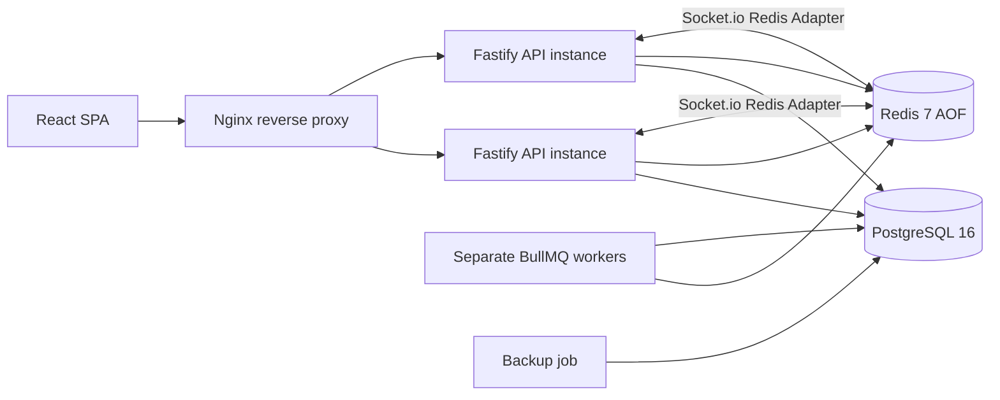
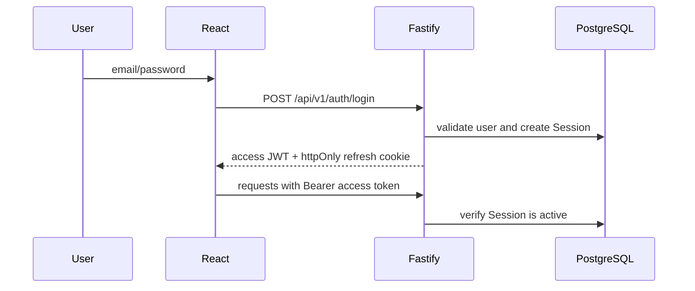
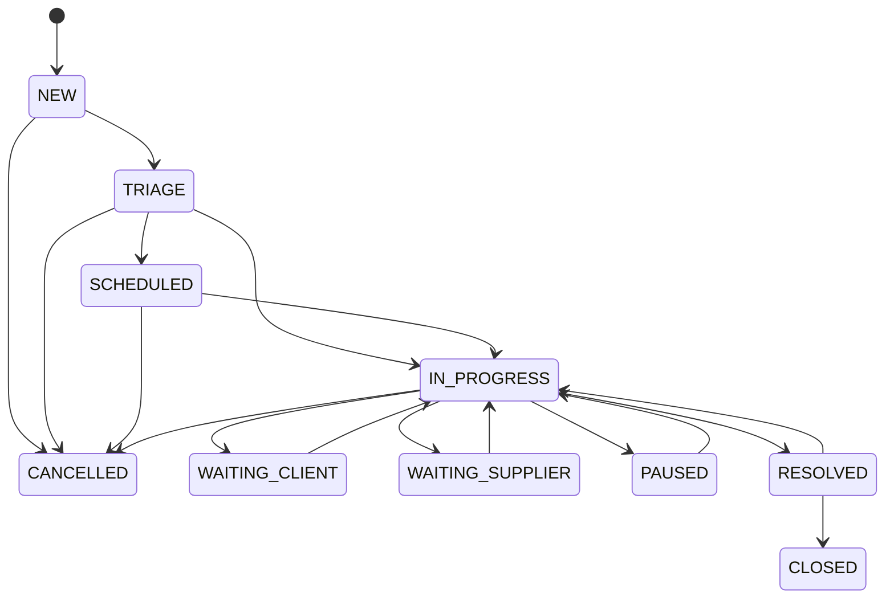
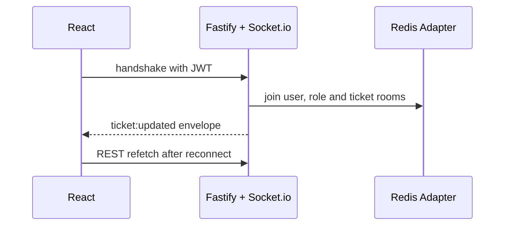
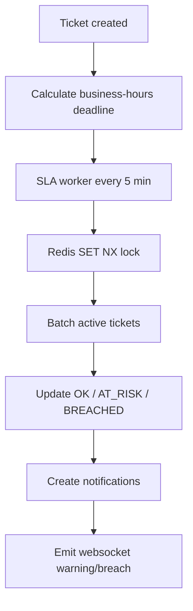
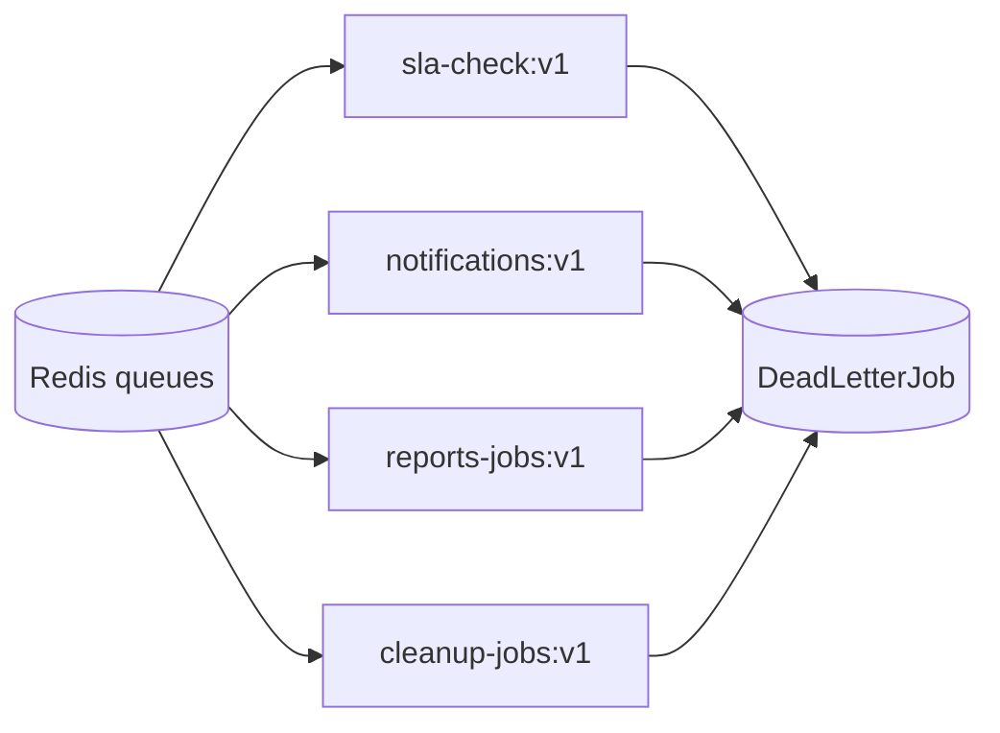
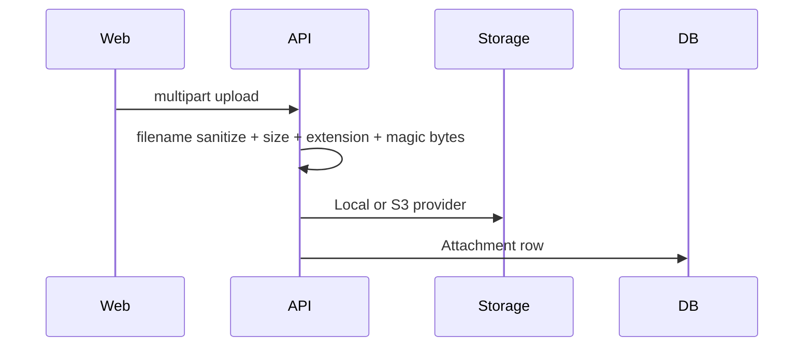
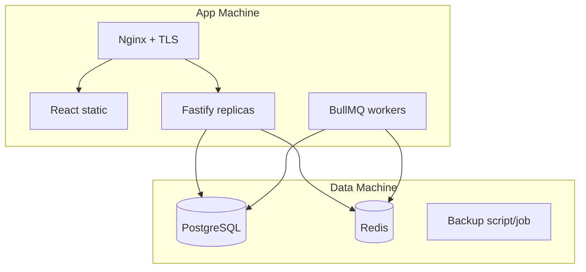

# Coworking Service Desk

[](https://github.com/denysg001/cowork-service-desk/actions/workflows/ci.yml)


Coworking Service Desk is a single-tenant SaaS operations platform for coworking teams. It is designed as a premium NOC-style control plane for tickets, SLA, rooms, companies, realtime communication, notifications, reporting, visual maps, and operational auditability.

It is not a generic helpdesk. The product assumes the coworking operator owns the installation, companies are customers of that coworking, and users with `CLIENT` role belong to those companies. `OPERATOR` and `ADMIN` users are internal coworking staff.

## Table Of Contents

- [Product Vision](#product-vision)
- [NOC Concept](#noc-concept)
- [Architecture](#architecture)
- [Diagrams](#diagrams)
- [Stack](#stack)
- [Repository Structure](#repository-structure)
- [Requirements](#requirements)
- [Local Setup](#local-setup)
- [Seed Credentials](#seed-credentials)
- [Environment Variables](#environment-variables)
- [Development](#development)
- [Production](#production)
- [Scalability](#scalability)
- [Realtime](#realtime)
- [SLA Engine](#sla-engine)
- [Security](#security)
- [Uploads](#uploads)
- [Observability](#observability)
- [Cache](#cache)
- [Workers](#workers)
- [Database](#database)
- [Operational Flow](#operational-flow)
- [Frontend](#frontend)
- [Dashboard](#dashboard)
- [Map](#map)
- [Chat](#chat)
- [Tests](#tests)
- [TestSprite](#testsprite)
- [CI/CD](#cicd)
- [Backup And Restore](#backup-and-restore)
- [Troubleshooting](#troubleshooting)
- [Roadmap](#roadmap)
- [Project Philosophy](#project-philosophy)

## Product Vision

The platform replaces spreadsheets, ad hoc chat groups, and informal ticket tracking with a realtime operational system for coworking facilities. It supports:

- client-originated tickets through web or QR-code room links;
- internal operator triage and assignment;
- SLA tracking by category and business hours;
- client and internal chat channels;
- room map visibility using relative coordinates;
- supplier involvement without making suppliers tenants;
- audit trails for operational accountability;
- realtime updates through Socket.io with REST as source of truth.

## NOC Concept

The interface is intended to feel like a coworking operations center:

- dense but legible operational information;
- dark premium control-room aesthetic;
- ticket queues, SLA status, room map, realtime counters and alerts;
- monospace protocol identifiers for ticket numbers, rooms and jobs;
- operational widgets rather than marketing cards;
- fast recovery from websocket, Redis, worker or SMTP degradation.

## Difference From A Generic Helpdesk

Generic helpdesks focus on request threads. This platform focuses on operating a physical coworking environment:

- rooms and locations are first-class entities;
- SLA is based on coworking business hours and category policy;
- companies are customers, not tenants;
- internal operators have operational dashboards, maps and reports;
- websocket is used for control-room responsiveness but never becomes the source of truth;
- workers and queues handle SLA, notification, report and cleanup workloads separately from HTTP.

## Architecture

The MVP architecture uses two machines:

- Data machine: PostgreSQL 16, Redis 7 and backup jobs.
- App machine: Nginx, static React build, stateless Fastify API and BullMQ workers.

The backend is stateless and can run multiple instances. Sessions are persisted in PostgreSQL. Redis is used for cache, queues, pub/sub and distributed locks only.

## Diagrams

### General Architecture



### Auth



### Ticket Flow



### Websocket



### SLA



### Workers



### Uploads



### Deploy



## Stack

| Layer | Technology |
| --- | --- |
| Frontend | React 18, TypeScript strict, Vite, Tailwind CSS, shadcn-style primitives, Zustand |
| Data fetching | TanStack Query v5, Axios |
| Forms | React Hook Form, Zod |
| Realtime | Socket.io client/server, Redis Adapter |
| Backend | Node.js 20, Fastify, TypeScript strict |
| Database | PostgreSQL 16, Prisma ORM |
| Cache/Queues | Redis 7 AOF, BullMQ |
| Auth | JWT access token, httpOnly refresh cookie, bcrypt |
| Logs | Winston JSON |
| Tests | Vitest |
| Infra | Docker Compose, Nginx, Prometheus, Grafana provisioning |

## Repository Structure

The repository currently uses pnpm workspaces:

```text
apps/api       Fastify backend
apps/web       React frontend
apps/worker    BullMQ workers
packages/shared shared contracts and Zod schemas
infra          compose, nginx, postgres, redis, observability
docs           architecture, operations and governance docs
.github        workflows and templates
```

## Requirements

- Node.js 20.x
- pnpm 9.x
- Docker and Docker Compose
- GitHub CLI for publishing and workflow inspection

## Local Setup

```bash
git clone https://github.com/denysg001/cowork-service-desk.git
cd cowork-service-desk
cp .env.example .env
npx pnpm@9.12.3 install
docker compose -f infra/docker-compose.db.yml up -d
npx pnpm@9.12.3 --filter @cowork/api prisma:generate
npx pnpm@9.12.3 --filter @cowork/api prisma:dev
npx pnpm@9.12.3 --filter @cowork/api prisma:seed
npx pnpm@9.12.3 --filter @cowork/api dev
npx pnpm@9.12.3 --filter @cowork/worker dev
npx pnpm@9.12.3 --filter @cowork/web dev
```

## Seed Credentials

| Role | Email | Password |
| --- | --- | --- |
| ADMIN | admin@coworking.com | admin123 |
| OPERATOR | op1@coworking.com | oper123 |
| OPERATOR | op2@coworking.com | oper123 |

## Environment Variables

| Variable | Purpose |
| --- | --- |
| `DATABASE_URL` | PostgreSQL connection URL with pool limits |
| `REDIS_URL` | Redis URL with password |
| `JWT_ACCESS_SECRET` / `JWT_SECRET` | Access token signing secret |
| `JWT_REFRESH_SECRET` / `REFRESH_SECRET` | Refresh token signing secret |
| `COOKIE_SECRET` | Fastify cookie signing secret |
| `FRONTEND_URL` / `WEB_PUBLIC_URL` | Frontend allow-list origin |
| `COWORKING_TIMEZONE` | SLA business timezone |
| `BODY_LIMIT_BYTES` | JSON payload limit |
| `SESSION_MAX_PER_USER` | Active session cap per user |
| `JWT_CLOCK_SKEW_SECONDS` | JWT clock tolerance |
| `UPLOAD_MAX_SIZE_MB` | Upload size limit |
| `UPLOAD_ALLOWED_TYPES` | Comma-separated MIME allow-list |
| `UPLOAD_STORAGE` / `STORAGE_PROVIDER` | `local` or `s3` |
| `SMTP_*` | Email notification provider settings |

## Development

Run API, workers and frontend in separate terminals. Websocket reconnects automatically; REST remains the source of truth.

## Production

Use `infra/docker-compose.db.yml` on the data machine and `infra/docker-compose.app.yml` on the app machine. Put TLS termination in front of Nginx or configure Nginx with certificates. Enable `secure=true` cookies only behind confirmed HTTPS.

## Scalability

Backend instances are stateless. Scale API replicas with Compose, Swarm, Kubernetes or an external load balancer. Keep total Prisma connection limits below PostgreSQL `max_connections`, or introduce PgBouncer/managed pooling.

## Realtime

Socket.io rooms:

- `user:{userId}`
- `ticket:{ticketId}`
- `role:operator`
- `role:admin`

Event payloads include `version`, `correlationId` and `timestamp`.

## SLA Engine

SLA is category-based and uses the coworking timezone. The target design tracks business hours, pauses, reopenings, warnings and breaches through a distributed worker lock.

## Security

The platform uses JWT access tokens in memory, httpOnly refresh cookies, PostgreSQL-backed sessions, CORS allow-listing, CSP, rate limits, upload magic-byte validation and structured secret masking.

## Uploads

Uploads are validated by filename, path traversal rules, size, extension and magic bytes. Public uploads should be avoided in production; prefer controlled download routes and a future isolated asset domain.

## Observability

Fastify exposes `/metrics` for Prometheus. Logs are JSON and include `service` and `correlationId`. Worker failures persist in `DeadLetterJob`.

## Cache

Redis-backed cache supports explicit invalidation, stale-while-revalidate, jitter and lock-based stampede prevention. Sessions, chat messages, critical ticket reads and personalized notifications must not be cached.

## Workers

Workers are separate processes and never start Fastify. Queues are responsible for SLA checks, notifications, reports and cleanup. Failed final attempts are captured in DLQ.

## Database

PostgreSQL is the source of truth. Redis is not a session store. Migrations should use non-destructive expand/contract patterns in production.

## Operational Flow

1. Client opens ticket through web or QR code.
2. Operator triages, schedules or starts work.
3. SLA worker tracks risk/breach.
4. Operators use internal notes and client chat.
5. Ticket is resolved with diagnosis, action, validation and conclusion.
6. Client/operator closes or reopens according to policy.

## Frontend

The frontend uses an operational dark UI, route-level data fetching, websocket-driven invalidation and Zustand stores for auth and persistent filters.

## Dashboard

Dashboard widgets focus on open tickets, SLA risk, breaches, operator load, rooms and realtime notifications.

## Map

Rooms use relative `positionX`, `positionY`, `width` and `height` values so the map can scale across screens.

## Chat

Chat has client and internal channels. Internal messages are restricted to coworking staff.

## Tests

```bash
npx pnpm@9.12.3 build
npx pnpm@9.12.3 test
```

The target is 70% coverage. See `docs/TESTING.md` for current gaps and expansion plan.

## TestSprite

Use `docs/testsprite.md` and the PR template to validate architecture, concurrency, race conditions, websocket consistency, workers, DLQ, locks, cache, N+1 queries, performance and production readiness.

## CI/CD

GitHub Actions run install, Prisma generation, build and tests. PR title validation enforces Conventional Commits. Release workflow tags SemVer releases from `main`.

## Backup And Restore

Use `infra/scripts/backup.sh` and `infra/scripts/restore-test.sh`. Restore tests should run regularly against an isolated database.

## Troubleshooting

### Redis offline

API should continue without cache and without distributed websocket fanout. Workers and queues will pause until Redis returns.

### PostgreSQL offline

Readiness fails. API should not be considered deployable until PostgreSQL is available.

### Websocket does not connect

Check JWT handshake, Nginx upgrade headers, `/ws` proxy path and Redis Adapter connectivity.

### Cookies not set

Verify `sameSite`, `secure`, HTTPS, proxy trust and frontend/backend origins.

### CORS blocked

Confirm `FRONTEND_URL`/`CORS_ORIGINS` allow-list and never use wildcard origin with credentials.

### JWT failures

Check token expiration, clock skew and active Session row.

### Prisma migration failed

Do not reset production. Create a forward-only corrective migration.

### Nginx websocket failure

Verify `Upgrade` and `Connection` headers and proxy timeout.

### Queues stuck

Check Redis health, worker logs, concurrency limits, delayed jobs and DLQ growth.

### DLQ growing

Inspect job payload, final error, dependency health and retry configuration before reprocessing.

### Upload failing

Check file size, allowed MIME, extension mismatch, magic bytes and storage provider availability.

### High CPU

Inspect dashboard queries, report jobs, queue concurrency and missing indexes.

### Memory leak

Check websocket listeners, BullMQ listeners, timers and long-running batch jobs.

### Cache inconsistent

Validate explicit invalidation and stale key TTL.

### Dashboard does not update

Force REST refetch, inspect websocket connection and verify dashboard cache TTL.

### Worker not processing

Check worker process, Redis auth, queue names and lock keys.

### Idempotency conflict

Compare request hash and idempotency key scope.

### Optimistic locking 409

Frontend should refetch the ticket and retry with the latest version only after user confirmation.

## Roadmap

- `v0.1.0-alpha`: operational foundation.
- `v0.2.0-alpha`: complete domain modules and frontend flows.
- `v0.3.0-beta`: SLA engine, reporting and TestSprite hardening.
- `v1.0.0`: production stable with 70%+ coverage and deployment runbooks.

## Project Philosophy

Prefer predictable operations over clever abstractions. PostgreSQL is the source of truth. Redis accelerates but does not own critical state. Websocket improves responsiveness but REST resolves truth. Workers isolate slow and retryable work. Every production feature must be observable, reversible and testable.
