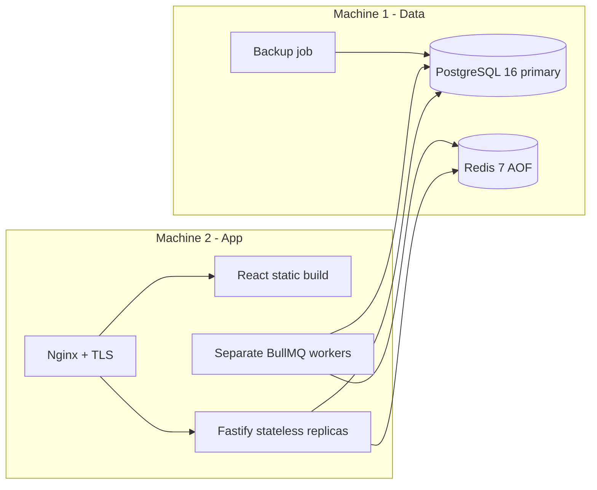

# Architecture

Coworking Service Desk is a single-tenant SaaS control plane for coworking operations.

## Two-Machine MVP

## Trade-offs

- PostgreSQL is primary-only in MVP. Read replicas are a phase-2 concern and require managed database support or real streaming replication.
- Redis is used for cache, BullMQ, pub/sub and distributed locks. It is not a source of truth for sessions.
- Websocket is an optimization. REST fetches resolve consistency after reconnect.
- Workers are separate processes to keep HTTP latency independent from retryable background work.

## Stateless API

The API stores no local process state required for correctness. Horizontal scaling is supported by:

- PostgreSQL-backed sessions;
- Socket.io Redis Adapter;
- Redis locks for single-run workers;
- explicit cache invalidation;
- readiness checks before traffic.

## Consistency Classes

- Strong: auth, sessions, ticket state, status transitions, audit trails.
- Eventual: dashboard cache, websocket notifications, async email, report jobs.

## Flow Diagrams

See `README.md` for Mermaid diagrams covering auth, tickets, websocket, SLA, workers, uploads and deploy.
